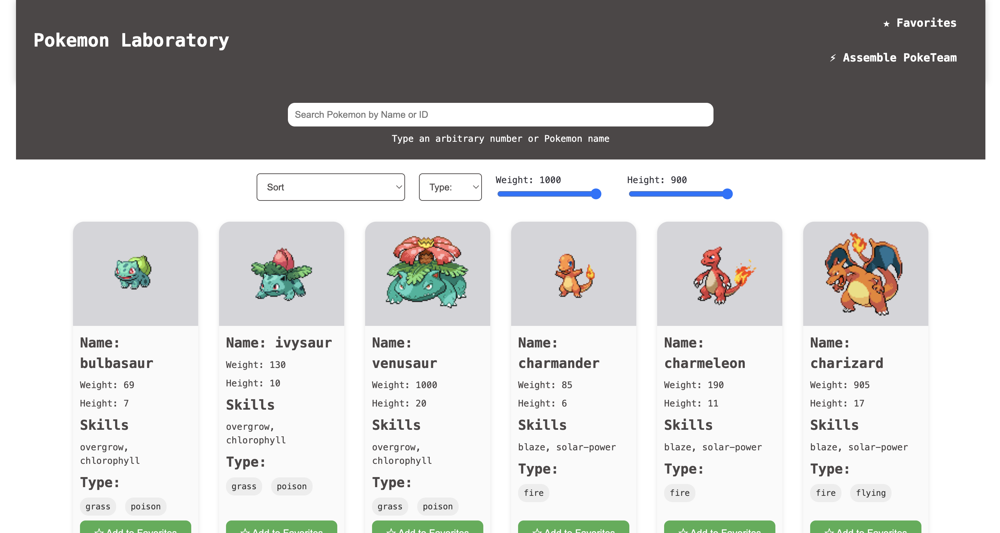
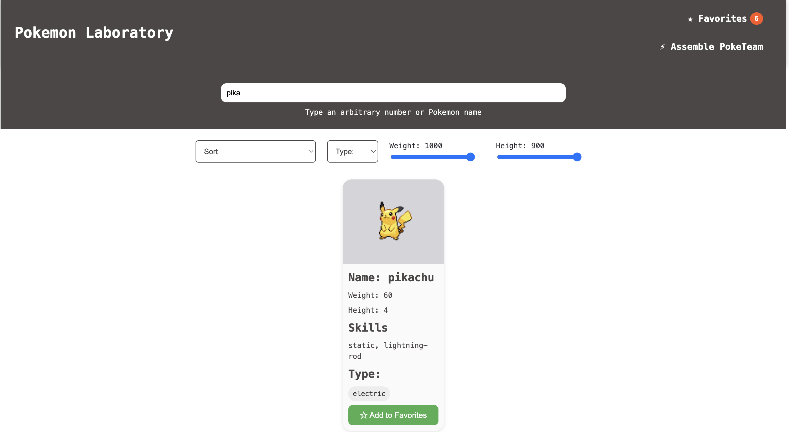
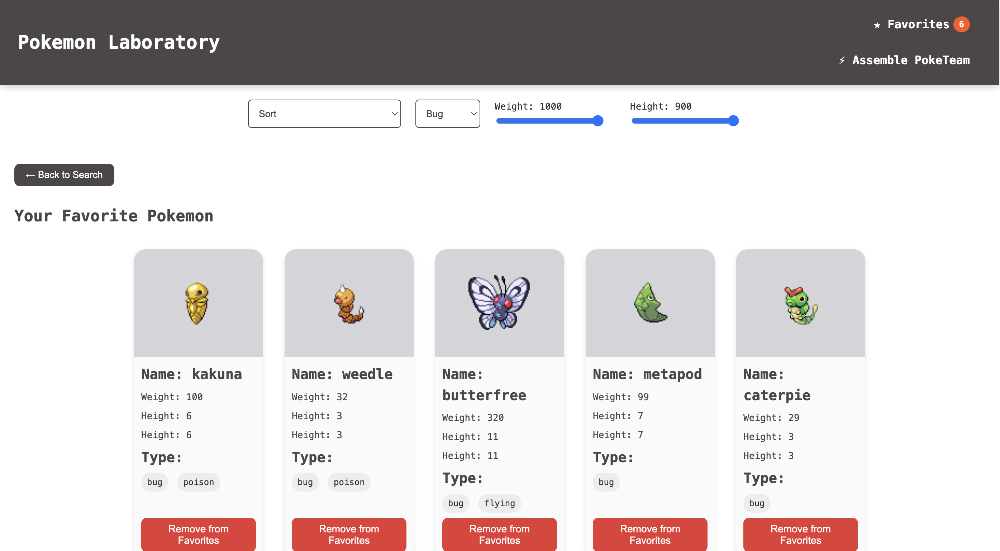
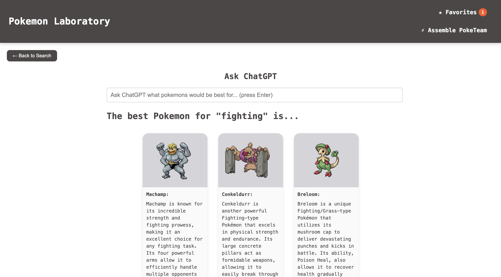

# Pokemon Labaratory

Web application for exploring Pokemon, filtering, sorting them, managing
favorites and generating AI-powered Pokemon teams for any task.

This project demonstrates modular frontend development and TDD workflow.

Data fetched from from the [PokeAPI](https://pokeapi.co/) open-source RESTful
API.



- Data dynamically fetched from PokeAPI
- Layout built with HTML, SCSS, JavaScript.
- Modular structure with Parcel bundler

**Parcel** - builds all files and dependencies automatically, bundling together
HTML, CSS, JS, images and other assets for development or production.

## Features

- **Search by input**

Type Pokemon name to search for a Pokémon and view detailed stats like name,
height, weight, and abilities.



- **Filter by:**

Type (fire, water, grass...), weight and height slider.


- **Favorites System:**

Add/Remove Pokemons from Favorites, Favorites page persists in localStorage.



- **AI Mode**

Backend calls OpenAI and returns Pokemon suggestions for any scenario "What
Pokemons are best for...?"



## Tech Stack

**Frontend**

- HTML / SCSS / JavaScript (Modular ES Modules)
- Parcel Bundler
- Handlebars (for templates)
- Vanilla DOM

**Backend**

- Node.js on Vercel
- Express-like API handler
- Calls OpenAI API though backend route:

`POST /api/openai`

**Testing**

- JEST (unit tests)
- Puppeteer (E2E browser automation)
- TDD workflow (RED -> GREEN -> REFACTOR)

## Prerequisites (modify later)

1. Node.js (v16+ recommended)

Download: https://nodejs.org/

2. npm (comes with Node.js)

3. Install project dependencies:

`npm install`

4. Puppeteer for automated testing (Optional) :

`npm install puppeteer --save-dev`

## Installation and Setup

1. Clone the repository

`git clone https://github.com/AnnaKompan/pokeApi.git`

2. Move to root directory

`cd pokeApi`

3. Run the development server (Parcel will start local development server)

`npm run start`

4. Build for production

`npm run build`

## Contributing

If you’d like to contribute:

1. Fork the repository

2. Create a feature branch:

`git checkout -b feature/your-feature`

3. Commit your changes

4. Push your branch:

`git push origin feature/your-feature`

5. Open a Pull Request

## Deployment

1. Enable GitHub Actions permissions -> Settings -> Actions -> General: Set up
   Workflow permissions to "Read and Write" && "Allow GitHub Actions to create
   and approve pull requests"

2. Create a workflow in root directory .github/workflows/deplot.yml with

```
name: Build and deploy to GitHub Pages

on:
  push:
    branches: [main]

jobs:
  build-and-deploy:
    runs-on: ubuntu-latest
    steps:
      - name: Checkout
        uses: actions/checkout@v2.3.1

      - name: Install and Build 🔧
        run: |
          npm ci
          npm run build

      - name: Deploy
        uses: JamesIves/github-pages-deploy-action@4.1.0
        with:
          branch: gh-pages
          folder: dist
```

3. Modify "homepage" and "build" in package.json your_username and
   your_repo_name

```
"homepage": "https://your_username.github.io/your_repo_name/",
"scripts": {
  "build": "parcel build src/*.html --public-url /your_repo_name/"
},
```

4. Set up GitHub Pages -> Settings -> Pages -> Choose Deploy from branch :
   gh-pages /(root)

## Testing (TDD Workflow)

The project was developed using the Test-Driven Development (TDD):

1. **RED** - write failing tests describing the expected behavior
2. **GREEN** - implement minimal code to make tests pass
3. **REFACTOR** - clean up and optimize

**ANNA**

1. **Test Describe 1 (RED)**:

Test verify incremental search (update results based on user inpu):

- search by the first letter
- search by sybstring returns exactly 1 Pokemon
- empty input returns all Pokemons
- unknown query returns an empty list

2. **Test Describe 2 (RED)**:

Test sorting functionality of Pokemons by weight and height would work
correctly.

Test cases should check sort:

- in ascending order by ID
- in descending order by ID
- A-Z alphabetic order
- Z-A alphabetic order

3. **Test Describe 3 (RED)**:

Test filtering functionality of Pokemons:

- by type (fire, water)
- by weight
- by height

Tests cover:

- return all Pokemons if no filter applied
- return 1 or multiple Pokemons that match the type
- return empty array if no matching filters
- weight slider filter
- height slider filter

4.  **Test Describe 4 (RED)**:

Since our APP is deployed at
[PokemonLabaratory](https://annakompan.github.io/pokeApi/), we can test it using
[Puppeteer](https://pptr.dev/):

- search by input
- search by A-Z
- filtering by type
- filtering by weight slider
- filtering by height slider

**JJ**

**DIMA**
