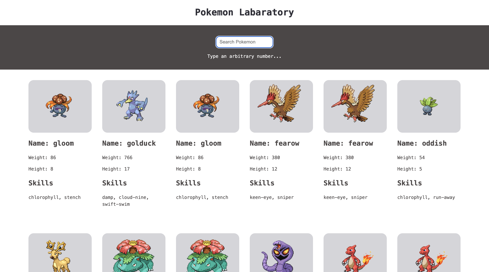

# Pokemon Labaratory

## About

Data fetched from from the [PokeAPI](https://pokeapi.co/) open-source RESTful
API.

Type any number to search for a Pokémon under specific ID and view detailed
stats like name, height, weight, and skills.



- Data dynamically fetched from PokeAPI
- Layout built with HTML, SCSS, JavaScript.
- Modular structure with Parcel bundler

**Parcel** - builds all files and dependencies automatically, bundling together
HTML, CSS, JS, images and other assets for development or production.

## Prerequisites (modify later)

1. Node.js (v16+ recommended)

Download: https://nodejs.org/

2. npm (comes with Node.js)

3. Install project dependencies:

`npm install`

4. Puppeteer for automated testing (Optional) :

`npm install puppeteer --save-dev`

## Installation and Setup

1. Clone the repository

`git clone https://github.com/AnnaKompan/pokeApi.git`

2. Move to root directory

`cd pokeApi`

3. Run the development server (Parcel will start local development server)

`npm run start`

4. Build for production

`npm run build`

## Contributing

If you’d like to contribute:

1. Fork the repository

2. Create a feature branch:

`git checkout -b feature/your-feature`

3. Commit your changes

4. Push your branch:

`git push origin feature/your-feature`

5. Open a Pull Request

## Deployment

1. Enable GitHub Actions permissions -> Settings -> Actions -> General: Set up
   Workflow permissions to "Read and Write" && "Allow GitHub Actions to create
   and approve pull requests"

2. Create a workflow in root directory .github/workflows/deplot.yml with

```
name: Build and deploy to GitHub Pages

on:
  push:
    branches: [main]

jobs:
  build-and-deploy:
    runs-on: ubuntu-latest
    steps:
      - name: Checkout
        uses: actions/checkout@v2.3.1

      - name: Install and Build 🔧
        run: |
          npm ci
          npm run build

      - name: Deploy
        uses: JamesIves/github-pages-deploy-action@4.1.0
        with:
          branch: gh-pages
          folder: dist
```

3. Modify "homepage" and "build" in package.json your_username and
   your_repo_name

```
"homepage": "https://your_username.github.io/your_repo_name/",
"scripts": {
  "build": "parcel build src/*.html --public-url /your_repo_name/"
},
```

4. Set up GitHub Pages -> Settings -> Pages -> Choose Deploy from branch :
   gh-pages /(root)

## Upcoming feature using TDD

- Filtering Pokemon by name or ability
- Sorting Pokemon (weight, height, aphabetic order)
- Favorite Pokemons Page (add Pokemon to favorites and store in localStorage of
  the browser)
- OpenAI API Pokemon Search (use AI to suggest Pokemon for specific task)
